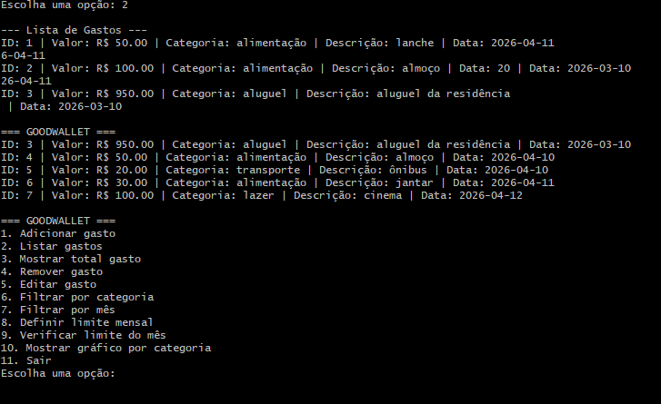
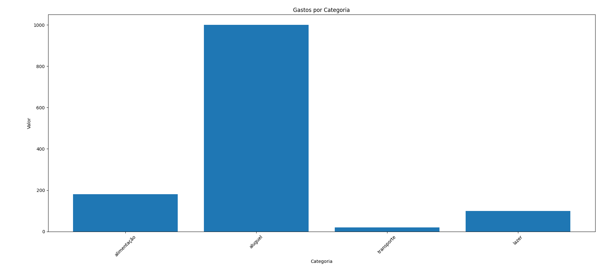

GoodWallet
Gerenciador de gastos pessoais em Python.
Descrição:
Aplicação em Python para gerenciamento de gastos pessoais, permitindo cadastrar, editar, remover, filtrar e visualizar despesas de forma simples.

Funcionalidades:
- Cadastro de gastos
- Classificação por categoria
- Listagem de despesas
- Controle de gastos mensais
- Edição e remoção de gastos
- Filtro por categoria
- Filtro por mês
- Definição de limite mensal
- Gráfico de gastos por categoria
- Adicionar gastos
- Listar gastos
- Editar gastos
- Remover gastos
- Verificar limite mensal

Tecnologias utilizadas:
- Python
- JSON
- Git
- GitHub
- Matplotlib

Estrutura do Projeto:
- app/: lógica principal
- data/: banco de dados
- docs/: documentação
- assets/: imagens
- `app/main.py` → menu principal da aplicação
- `app/services.py` → lógica do sistema
- `app/storage.py` → leitura e gravação em JSON
- `data/gastos.json` → armazenamento dos gastos
- `data/config.json` → configuração do limite mensal

Necessário para executar o projeto:
- pip install -r requirements.txt

Como executar o projeto:
1. Clone o repositório - git clone https://github.com/seu-usuario/GoodWallet.git
2. Entre na pasta - cd GoodWallet
3. Instale as dependências - python -m pip install -r requirements.txt
4. Execute o programa no python app/main.py - python -m app.main

Demonstração:

Autor:
Vinícius Martins
